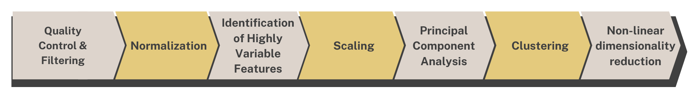
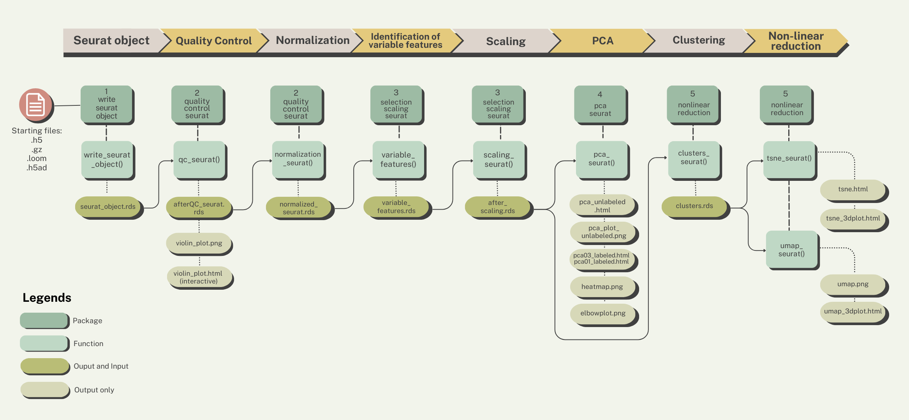

```{r setup, include=FALSE}
all_times <- list()  # store the time for each chunk
knitr::knit_hooks$set(time_it = local({
  now <- NULL
  function(before, options) {
    if (before) {
      now <<- Sys.time()
    } else {
      res <- difftime(Sys.time(), now, units = "secs")
      all_times[[options$label]] <<- res
    }
  }
}))
knitr::opts_chunk$set(
  tidy = TRUE,
  tidy.opts = list(width.cutoff = 95),
  message = FALSE,
  warning = FALSE,
  time_it = TRUE,
  error = TRUE
)
```

> This documents the use of OpenCPU for the pre-processing of scRNA sequences using Seurat v5.

# Pre-processing pipeline

The standard steps of the pre-processing of scRNA sequences are as follows:  The steps are performed separately using their own R functions that can be called individually in OpenCPU. But first let's set up our remote access.

# A. Before running the session

To-dos before we process our file:

-   Set up the remote connection

-   Learn how to use the HTTP methods

-   Learn how to read and access the files

### **Setting up on the browser**

To load OpenCPU on the browser, first determine the local server address. If on Windows, type **ipconfig** or if on Linux, **ifconfig**. It is usually the set of numbers located next to "inet". This will be referred to as "local host".

On your browser, load <http://localhost:8080/ocpu>.

### **HTTP Methods**

OpenCPU uses the HTTP methods **GET** (to retrieve a source) and **POST** (for RPC which is valid if targeting a script or function).

+----------+---------+-----------------+----------------------+------------------------------------------------------------+
| Method   | Target  | Action          | Parameters           | Example                                                    |
+==========+=========+=================+======================+============================================================+
| **GET**  | object  | read object     | N/A                  | GET /ocpu/library/writeseuratobject                        |
+----------+---------+-----------------+----------------------+------------------------------------------------------------+
| **POST** | object  | call a function | "input" (input file) | POST /ocpu/library/writeseuratobject/R/write_seurat_object |
+----------+---------+-----------------+----------------------+------------------------------------------------------------+
| **GET**  | file    | read a file     | N/A                  | GET /ocpu/library/writeseuratobject/DESCRIPTION            |
|          |         |                 |                      |                                                            |
|          |         |                 |                      | GET /ocpu/library/writeseuratobject/R/write_seurat_object  |
+----------+---------+-----------------+----------------------+------------------------------------------------------------+

### **API Endpoints**

There pre-processing pipeline for scRNA sequences are available on the server and can be accessed based on the path.

+--------------------------------------------+----------------------------------------------------------------+
| Path                                       | What                                                           |
+============================================+================================================================+
| /ocpu/library/{package name}/              | R packages installed in the global library of the server       |
+--------------------------------------------+----------------------------------------------------------------+
| /ocpu/library/{package name}/R/{function}/ | Function within the package                                    |
+--------------------------------------------+----------------------------------------------------------------+
| /ocpu/library/{package name}/DESCRIPTION   | Shows the description/details of the package                   |
+--------------------------------------------+----------------------------------------------------------------+
| /ocpu/tmp/{key}                            | Temporary session that hold outputs from a function/script RPC |
+--------------------------------------------+----------------------------------------------------------------+

### **R Package API**

Any of the /{package}/ libraries support the following endpoints:

+-------------------------+-----------------------------------------------------------------------------+
| Path                    | What                                                                        |
+=========================+=============================================================================+
| ../{package name}/info  | Show information about this package                                         |
+-------------------------+-----------------------------------------------------------------------------+
| ../{package name}/R/    | R objects/scripts exported by this package                                  |
+-------------------------+-----------------------------------------------------------------------------+
| ../{package name}/data/ | Data included in this package                                               |
+-------------------------+-----------------------------------------------------------------------------+
| ../{package name}/man/  | Manuals or help pages included in the package                               |
+-------------------------+-----------------------------------------------------------------------------+
| ../{package name}/html  | Simulates the R-base html help pages                                        |
+-------------------------+-----------------------------------------------------------------------------+
| ../{package name}/\*    | For all else, interfaces to the files in the package installation directory |
+-------------------------+-----------------------------------------------------------------------------+

### **R Object API**

+--------------------------------+-------------------------------------------------------------------------------------------------------------------------------------------------------+
| Path                           | What                                                                                                                                                  |
+================================+=======================================================================================================================================================+
| ../R/                          | Lists R objects in the package or session                                                                                                             |
+--------------------------------+-------------------------------------------------------------------------------------------------------------------------------------------------------+
| ../data/                       | List data objects in a package                                                                                                                        |
+--------------------------------+-------------------------------------------------------------------------------------------------------------------------------------------------------+
| ../R/object                    | Read object in default format. If **object** is a function, it can be called using HTTP POST to run the function or HTTP GET to display the function. |
+--------------------------------+-------------------------------------------------------------------------------------------------------------------------------------------------------+
| ../{R\|data}/{object}/{format} | Retrieve an R object in a particular output format                                                                                                    |
+--------------------------------+-------------------------------------------------------------------------------------------------------------------------------------------------------+

# B. Running a session

Each step of the pipeline have their own functions. These functions can be accessed via their respective packages. A guide on which packages and functions to use are shown below. {width="2000" height="339"}

::: {style="background-color:lightgray;"}
> To perform the quality control step:
>
> > POST ocpu/library/qualitycontrolseurat/R/qc_seurat
>
> where **qualitycontrolseurat** is the package name and **qc_seurat** is the function. Type "input" as the parameter name then upload the respective input file.
:::

### **API Endpoints for the pipeline**

The table lists the packages for the workflow and the function included per package. The <mark>**mandatory parameter name**</mark> for all the function is "**input**" and will only take a <mark>single input file or **mandatory parameter value**</mark>. The functions can be called using **POST** before the API Endpoint.

+------------------------+------------------------+---------------------------------------------------------------------------------------+--------------------------------------------------------+
| Package                | Function               | Mandatory parameter value                                                             | API Endpoint                                           |
+========================+========================+=======================================================================================+========================================================+
| writeseuratobject      | write_seurat_object()  | File with the ff. extensions: ".gz", ".h5", ".loom", ".h5ad"                          | ../library/writeseuratobject/R/write_seurat_object     |
+------------------------+------------------------+---------------------------------------------------------------------------------------+--------------------------------------------------------+
| qualitycontrolseurat   | qc_seurat()            | Seurat object with .rds extension/file named "seurat_object.rds"                      | ../library/qualitycontrolseurat/R/qc_seurat            |
+------------------------+------------------------+---------------------------------------------------------------------------------------+--------------------------------------------------------+
| qualitycontrolseurat   | normalization_seurat() | Seurat object after QC/file named "afterQC_seurat.rds"                                | ../library/qualitycontrolseurat/R/normalization_seurat |
+------------------------+------------------------+---------------------------------------------------------------------------------------+--------------------------------------------------------+
| selectionscalingseurat | variable_features()    | Seurat object after normalization/file named "normalized_seurat.rds"                  | ../library/selectionscalingseurat/R/variable_features  |
+------------------------+------------------------+---------------------------------------------------------------------------------------+--------------------------------------------------------+
| selectionscalingseurat | scaling_seurat()       | Seurat object after selection of variable features/file named "variable_features.rds" | ../library/selectionscalingseurat/R/scaling_seurat     |
+------------------------+------------------------+---------------------------------------------------------------------------------------+--------------------------------------------------------+
| pcaseurat              | pca_seurat()           | Seurat object after scaling/file named "after_scaling.rds"                            | ../library/pcaseurat/R/pca_seurat                      |
+------------------------+------------------------+---------------------------------------------------------------------------------------+--------------------------------------------------------+
| nonlinearreduction     | clusters_seurat()      | Seurat object after scaling/file named "after_scaling.rds"                            | ../library/nonlinearreduction/R/clusters_seurat        |
+------------------------+------------------------+---------------------------------------------------------------------------------------+--------------------------------------------------------+
| nonlinearreduction     | tsne_seurat()          | Seurat object after clustering/file named "clusters.rds"                              | ../library/nonlinearreduction/R/tsne_seurat            |
+------------------------+------------------------+---------------------------------------------------------------------------------------+--------------------------------------------------------+
| nonlinearreduction     | umap_seurat()          | Seurat object after clustering/file named "clusters.rds"                              | ../library/nonlinearreduction/R/umap_seurat            |
+------------------------+------------------------+---------------------------------------------------------------------------------------+--------------------------------------------------------+

::: {style="background-color:lightgray;"}
> If using the packages from the beginning (writeseuratobject), the mandatory parameter value is the file generated from the step previous. See figure 2 as guide.
:::

### **Input, Output: Data and Formats**

These are the extensions of input and output files.

| Format | Content-type    | Notes                                   |
|--------|-----------------|-----------------------------------------|
| h5     | list/matrix     | input for the writeseuratobject package |
| gz     | zipped matrix   | input for the writeseuratobject package |
| loom   | matrix          | input for the writeseuratobject package |
| h5ad   | annotation data | input for the writeseuratobject package |
| rds    | seurat object   | both input and output of packages       |
| png    | image           | output only                             |
| html   | web content     | output only                             |

# C. After running a session

### **R Sessions API**

+---------------------------------------+---------------------------------------------------------------------------------------------------------------------------------------------------------+
| Path                                  | What                                                                                                                                                    |
+=======================================+=========================================================================================================================================================+
| /ocpu/tmp/{key}/                      | List available output for this session                                                                                                                  |
+---------------------------------------+---------------------------------------------------------------------------------------------------------------------------------------------------------+
| /ocpu/tmp/{key}/R                     | R objects stored in this session. Interface using R object API, same as objects in packages                                                             |
+---------------------------------------+---------------------------------------------------------------------------------------------------------------------------------------------------------+
| /ocpu/tmp/{key}/graphics/             | Graphics (plots) stored in this session                                                                                                                 |
+---------------------------------------+---------------------------------------------------------------------------------------------------------------------------------------------------------+
| /ocpu/tmp/{key}/graphics/{n}/{format} | Retrieve plot number **{n}** in output format **{format}**. Format is usually one of **png**, **pdf**, or **svg**. The **{n}** is an integer or "last". |
+---------------------------------------+---------------------------------------------------------------------------------------------------------------------------------------------------------+
| /ocpu/tmp/{key}/source                | Reads the input source code for this session                                                                                                            |
+---------------------------------------+---------------------------------------------------------------------------------------------------------------------------------------------------------+
| /ocpu/tmp/{key}/stdout                | Shows text printed to STDOUT in this session                                                                                                            |
+---------------------------------------+---------------------------------------------------------------------------------------------------------------------------------------------------------+
| /ocpu/tmp/{key}/console               | Shows the console input/output for this session (combines source and stdout)                                                                            |
+---------------------------------------+---------------------------------------------------------------------------------------------------------------------------------------------------------+
| /ocpu/tmp/{key}/zip                   | Download the entire session as a zip archive                                                                                                            |
+---------------------------------------+---------------------------------------------------------------------------------------------------------------------------------------------------------+
| /ocpu/tmp/{key}/tar                   | Download the entire session as a gzipped tarball                                                                                                        |
+---------------------------------------+---------------------------------------------------------------------------------------------------------------------------------------------------------+
| /ocpu/tmp/{key}/files/\*              | Interfaces to the file API in the working dir of the session                                                                                            |
+---------------------------------------+---------------------------------------------------------------------------------------------------------------------------------------------------------+

### **HTTP Status Codes**

The codes returned by OpenCPU

+-----------------+-------------------------------------------------------+--------------------------------------------------------------------+
| HTTP Code       | When                                                  | Returns                                                            |
+=================+=======================================================+====================================================================+
| 200 OK          | On successful GET request                             | Resource content                                                   |
+-----------------+-------------------------------------------------------+--------------------------------------------------------------------+
| 201 Created     | On successful POST request                            | Output location                                                    |
+-----------------+-------------------------------------------------------+--------------------------------------------------------------------+
| 302 Found       | Redirect                                              | Redirect Location                                                  |
+-----------------+-------------------------------------------------------+--------------------------------------------------------------------+
| 400 Bad Request | R raised an error                                     | Error message in **text/plain**                                    |
+-----------------+-------------------------------------------------------+--------------------------------------------------------------------+
| 502 Bad Gateway | Nginx (opencpu-cache) can't connect to OpenCPU server | (Should be resolved by the administrator by looking in error logs) |
+-----------------+-------------------------------------------------------+--------------------------------------------------------------------+
| 503 Bad Request | Serious problem with the server                       | (Should be resolved by the administrator by looking in error logs) |
+-----------------+-------------------------------------------------------+--------------------------------------------------------------------+

### **API Outputs after running the steps of the pipeline**

+--------------------------------------------------------+--------------------------------------------------+
| API call endpoint                                      | Responses/Output                                 |
+========================================================+==================================================+
| ../library/writeseuratobject/R/write_seurat_object     | /ocpu/tmp/{key}/R/write_seurat_object            |
|                                                        |                                                  |
|                                                        | /ocpu/tmp/{key}/source                           |
|                                                        |                                                  |
|                                                        | /ocpu/tmp/{key}/console                          |
|                                                        |                                                  |
|                                                        | /ocpu/tmp/{key}/info                             |
|                                                        |                                                  |
|                                                        | /ocpu/tmp/{key}/files/DESCRIPTION                |
|                                                        |                                                  |
|                                                        | /ocpu/tmp/{key}/files/seurat_object.rds          |
|                                                        |                                                  |
|                                                        | /ocpu/tmp/{key}/files/{input file}               |
+--------------------------------------------------------+--------------------------------------------------+
| ../library/qualitycontrolseurat/R/qc_seurat            | /ocpu/tmp/{key}/qc_seurat                        |
|                                                        |                                                  |
|                                                        | /ocpu/tmp/{key}/source                           |
|                                                        |                                                  |
|                                                        | /ocpu/tmp/{key}/console                          |
|                                                        |                                                  |
|                                                        | /ocpu/tmp/{key}/info                             |
|                                                        |                                                  |
|                                                        | /ocpu/tmp/{key}/files/afterQC_seurat.rds         |
|                                                        |                                                  |
|                                                        | /ocpu/tmp/{key}/files/DESCRIPTION                |
|                                                        |                                                  |
|                                                        | /ocpu/tmp/{key}/files/seurat_object.rds          |
|                                                        |                                                  |
|                                                        | /ocpu/tmp/{key}/files/violin_plot.png            |
|                                                        |                                                  |
|                                                        | /ocpu/tmp/{key}/files/violin_plots.html          |
|                                                        |                                                  |
|                                                        | /ocpu/tmp/{key}/files/scatter_plots.html         |
+--------------------------------------------------------+--------------------------------------------------+
| ../library/qualitycontrolseurat/R/normalization_seurat | /ocpu/tmp/{key}/normalization_seurat             |
|                                                        |                                                  |
|                                                        | /ocpu/tmp/{key}/source                           |
|                                                        |                                                  |
|                                                        | /ocpu/tmp/{key}/console                          |
|                                                        |                                                  |
|                                                        | /ocpu/tmp/{key}/info                             |
|                                                        |                                                  |
|                                                        | /ocpu/tmp/{key}/files/after_normalization.rds    |
|                                                        |                                                  |
|                                                        | /ocpu/tmp/{key}/files/DESCRIPTION                |
|                                                        |                                                  |
|                                                        | /ocpu/tmp/{key}/files/afterQC_seurat.rds         |
+--------------------------------------------------------+--------------------------------------------------+
| ../library/selectionscalingseurat/R/variable_features  | /ocpu/tmp/{key}/variable_features                |
|                                                        |                                                  |
|                                                        | /ocpu/tmp/{key}/source                           |
|                                                        |                                                  |
|                                                        | /ocpu/tmp/{key}/console                          |
|                                                        |                                                  |
|                                                        | /ocpu/tmp/{key}/info                             |
|                                                        |                                                  |
|                                                        | /ocpu/tmp/{key}/files/normalized_seurat.rds      |
|                                                        |                                                  |
|                                                        | /ocpu/tmp/{key}/files/DESCRIPTION                |
|                                                        |                                                  |
|                                                        | /ocpu/tmp/{key}/files/top10_variablefeatures.rds |
|                                                        |                                                  |
|                                                        | /ocpu/tmp/{key}/files/variable_features_plot.png |
|                                                        |                                                  |
|                                                        | /ocpu/tmp/{key}/files/variablefeatures.rds       |
+--------------------------------------------------------+--------------------------------------------------+
| ../library/selectionscalingseurat/R/scaling_seurat     | /ocpu/tmp/{key}/scaling_seurat                   |
|                                                        |                                                  |
|                                                        | /ocpu/tmp/{key}/source                           |
|                                                        |                                                  |
|                                                        | /ocpu/tmp/{key}/console                          |
|                                                        |                                                  |
|                                                        | /ocpu/tmp/{key}/info                             |
|                                                        |                                                  |
|                                                        | /ocpu/tmp/{key}/files/after_scaling.rds          |
|                                                        |                                                  |
|                                                        | /ocpu/tmp/{key}/files/normalized_seurat.rds      |
|                                                        |                                                  |
|                                                        | /ocpu/tmp/{key}/files/DESCRIPTION                |
+--------------------------------------------------------+--------------------------------------------------+
| ../library/pcaseurat/R/pca_seurat                      | /ocpu/tmp/{key}/pca_seurat                       |
|                                                        |                                                  |
|                                                        | /ocpu/tmp/{key}/source                           |
|                                                        |                                                  |
|                                                        | /ocpu/tmp/{key}/console                          |
|                                                        |                                                  |
|                                                        | /ocpu/tmp/{key}/info                             |
|                                                        |                                                  |
|                                                        | /ocpu/tmp/{key}/graphics/1                       |
|                                                        |                                                  |
|                                                        | /ocpu/tmp/{key}/files/clusters.rds               |
|                                                        |                                                  |
|                                                        | /ocpu/tmp/{key}/files/DESCRIPTION                |
|                                                        |                                                  |
|                                                        | /ocpu/tmp/{key}/files/pca_2d_unlabeled.html      |
|                                                        |                                                  |
|                                                        | /ocpu/tmp/{key}/files/pca03_2dplot_labeled.html  |
|                                                        |                                                  |
|                                                        | /ocpu/tmp/{key}/files/pca01_2dplot_labeled.html  |
|                                                        |                                                  |
|                                                        | /ocpu/tmp/{key}/files/pca_3dplot.html            |
|                                                        |                                                  |
|                                                        | /ocpu/tmp/{key}/files/pca_results.png            |
|                                                        |                                                  |
|                                                        | /ocpu/tmp/{key}/files/pca_plot_unlabeled.png     |
|                                                        |                                                  |
|                                                        | /ocpu/tmp/{key}/files/heatmap.png                |
|                                                        |                                                  |
|                                                        | /ocpu/tmp/{key}/files/heatmap_multiple.png       |
|                                                        |                                                  |
|                                                        | /ocpu/tmp/{key}/files/elbowplot.png              |
+--------------------------------------------------------+--------------------------------------------------+
| ../library/nonlinearreduction/R/clusters_seurat        | /ocpu/tmp/{key}/clusters_seurat                  |
|                                                        |                                                  |
|                                                        | /ocpu/tmp/{key}/source                           |
|                                                        |                                                  |
|                                                        | /ocpu/tmp/{key}/console                          |
|                                                        |                                                  |
|                                                        | /ocpu/tmp/{key}/info                             |
|                                                        |                                                  |
|                                                        | /ocpu/tmp/{key}/files/DESCRIPTION                |
|                                                        |                                                  |
|                                                        | /ocpu/tmp/{key}/files/after_scaling.rds          |
|                                                        |                                                  |
|                                                        | /ocpu/tmp/{key}/files/clusters.rds               |
+--------------------------------------------------------+--------------------------------------------------+
| ../library/nonlinearreduction/R/tsne_seurat            | /ocpu/tmp/{key}/tsne_seurat                      |
|                                                        |                                                  |
|                                                        | /ocpu/tmp/{key}/source                           |
|                                                        |                                                  |
|                                                        | /ocpu/tmp/{key}/console                          |
|                                                        |                                                  |
|                                                        | /ocpu/tmp/{key}/info                             |
|                                                        |                                                  |
|                                                        | /ocpu/tmp/{key}/files/DESCRIPTION                |
|                                                        |                                                  |
|                                                        | /ocpu/tmp/{key}/files/clusters.rds               |
|                                                        |                                                  |
|                                                        | /ocpu/tmp/{key}/files/tsne_2dplot.html           |
|                                                        |                                                  |
|                                                        | /ocpu/tmp/{key}/files/tsne_3dplot.html           |
+--------------------------------------------------------+--------------------------------------------------+
| ../library/nonlinearreduction/R/umap_seurat            | /ocpu/tmp/{key}/umap_seurat                      |
|                                                        |                                                  |
|                                                        | /ocpu/tmp/{key}/source                           |
|                                                        |                                                  |
|                                                        | /ocpu/tmp/{key}/console                          |
|                                                        |                                                  |
|                                                        | /ocpu/tmp/{key}/info                             |
|                                                        |                                                  |
|                                                        | /ocpu/tmp/{key}/files/DESCRIPTION                |
|                                                        |                                                  |
|                                                        | /ocpu/tmp/{key}/files/clusters.rds               |
|                                                        |                                                  |
|                                                        | /ocpu/tmp/{key}/files/umap_2dplot.html           |
|                                                        |                                                  |
|                                                        | /ocpu/tmp/{key}/files/umap_3dplot.html           |
+--------------------------------------------------------+--------------------------------------------------+
